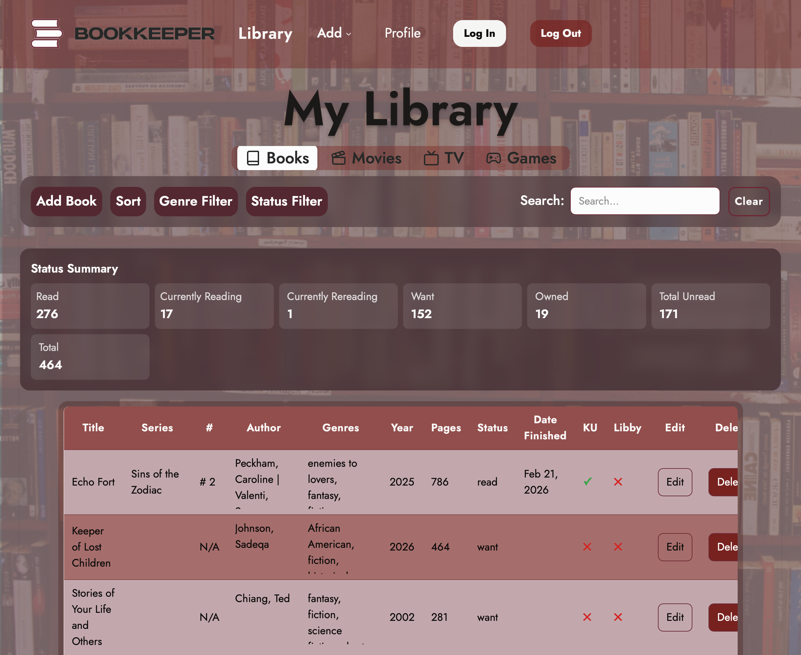
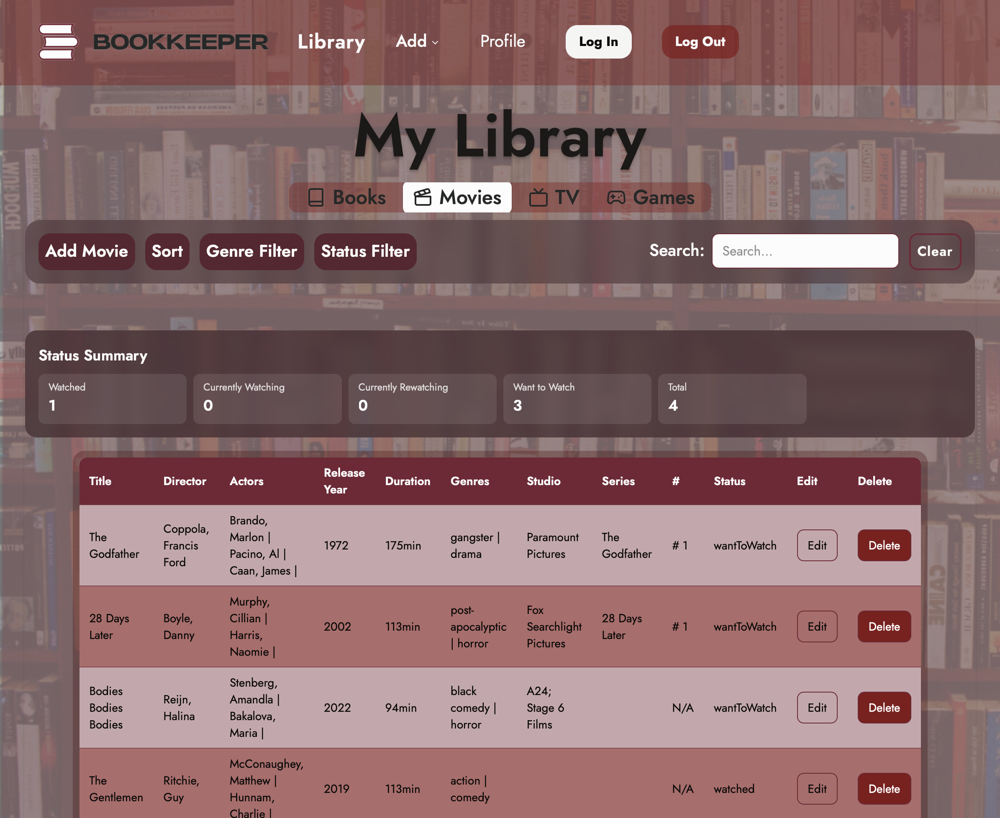
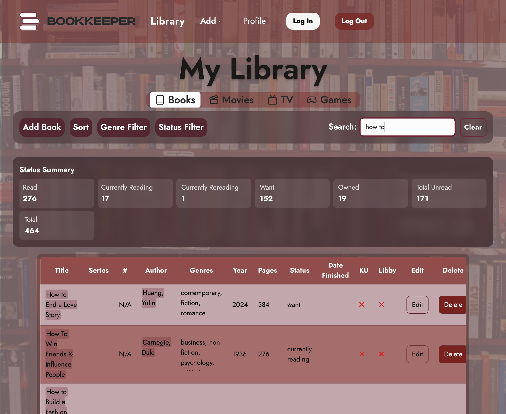
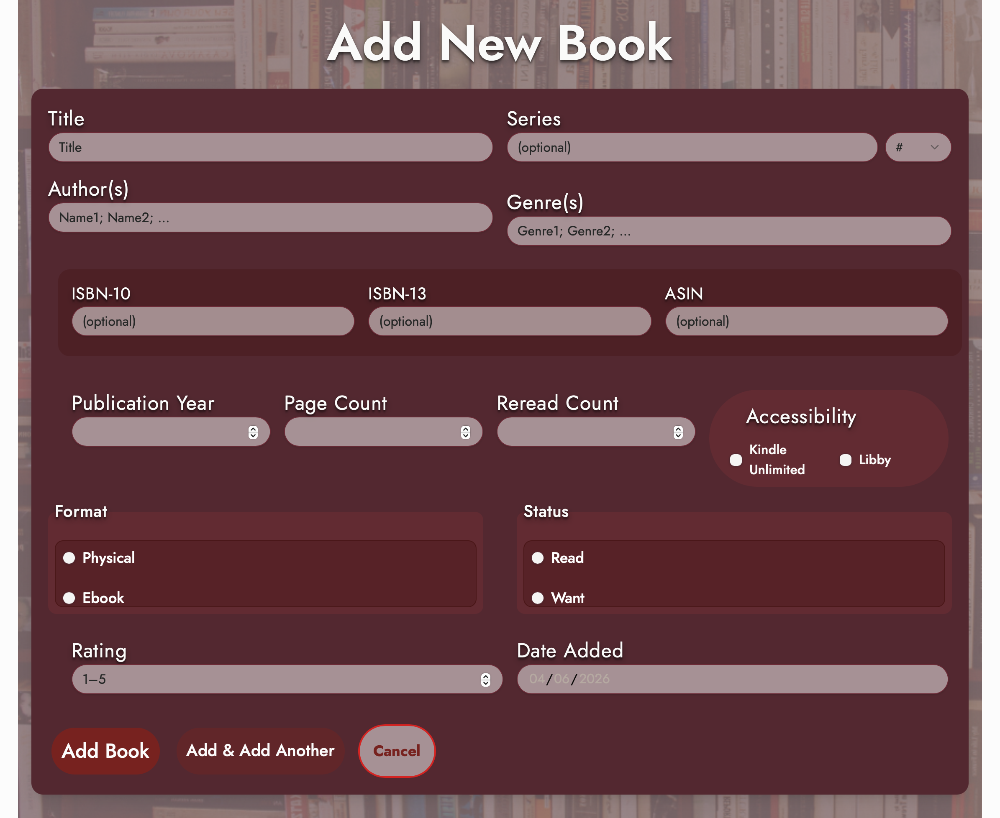

# BookKeeper

Full-stack personal media tracking application that allows users to catalog, organize, and analyze books, movies, TV shows, and games in one unified system.

Link to project: Coming Soon

## Key Features
 - Track books, movies, TV shows, and video games in one platform
 - Advanced filtering and sorting by genre, status, and metadata
 - User authentication with private, secure libraries (Auth0)
 - Detailed media records including ratings, formats, and reading history
 - Dynamic status tracking (read, currently reading, want to consume, etc.)
 - Scalable data model supporting flexible media attributes

## Technical Highlights
 - Designed RESTful API using Node.js and Express for scalable data operations
 - Implemented flexible MongoDB schema to support multiple media types
 - Integrated Auth0 for secure authentication and protected routes
 - Built reusable React components for maintainable UI architecture
 - Optimized filtering and sorting logic for large datasets
 - Containerized application using Docker for consistent environments

## Tech Stack
 - Frontend: React, Vite, Tailwind CSS
 - Backend: Node.js, Express
 - Database: MongoDB
 - Auth: Auth0
 - DevOps: Docker

## Screenshots

### Home Screen

### Library Page - Books

### Library Page - Movies

### Search

### Details Page

### Book Form

